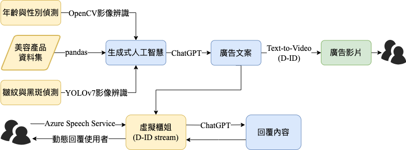

# MyBeautyAI

## Environment

> Tip: Create a conda environment and run below command

- `pip install -r requirements.txt`

## File Download

>  Move the traced_model.pt file to MyBeautyAI folder

- url:[traced_model.pt file](https://drive.google.com/file/d/1ho1tNiyQL7jx2DaxpsmQ-mTYnercyRQJ/view?usp=sharing)

## Modify Code

1. You need to have own **Azure API KEY and Build Azure Speech Service**, then modify corresponding code in connect.py
2. When you run the code and face the **can't have D-ID ID** problem, you need to change the API KEY. You can get it from **D-ID accounts.xlsx** file and modify api.json.

## Run Code in Terminal

> Tip: You must have to give the correct **connect.py path**

1. `cd {folder_path} `
2. `python connect.py`

## Architecture Diagram

## Using Embedding to Response
- https://www.canva.com/design/DAF4Girfp7c/7ChyUgSBOYVJMHqslTeoig/view?utm_content=DAF4Girfp7c&utm_campaign=designshare&utm_medium=link&utm_source=editor
- Approach 1: Just using openai embedding
  - Pros: Response clear and professional
  - Cons: Long response time, not suitable for real-time Q&A, and reply sentence is too long
- Approach 2: Using openai embedding and chatgpt to short the sentences
  - Pros: Can using D-ID, Don't change the architecture, and Remain professional
  - Cons: Long response time and Need to create many google accounts for D-ID
